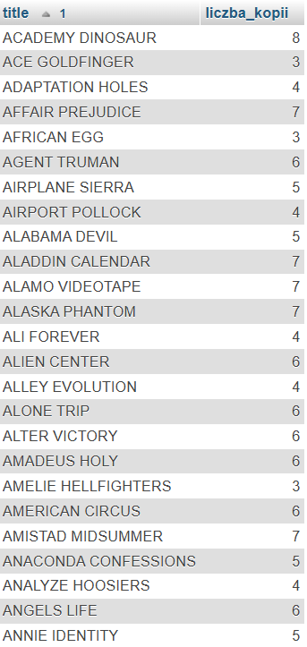
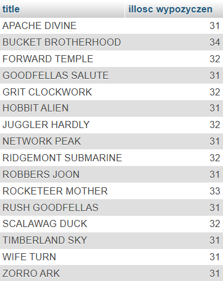
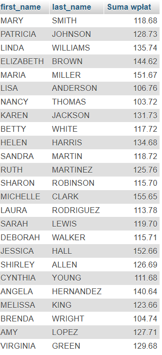
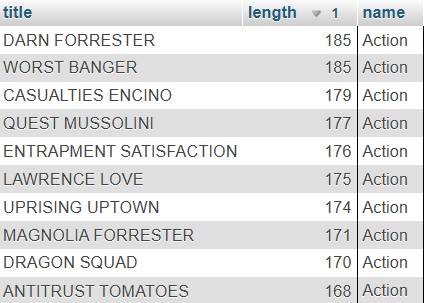
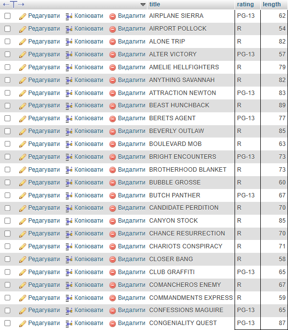
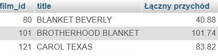
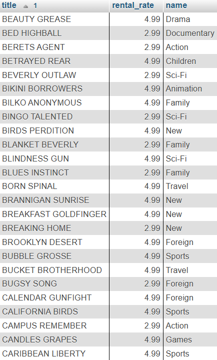
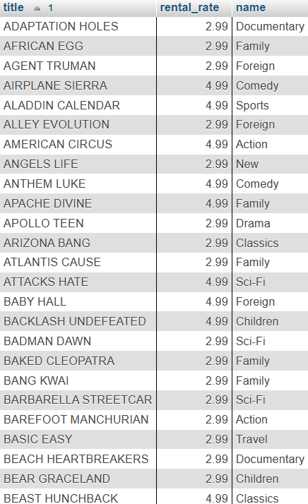
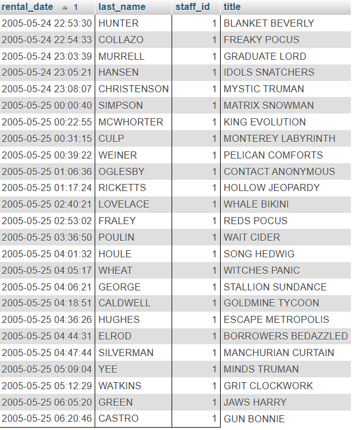

### Zadanie 1
SELECT f.title, COUNT(i.inventory_id) AS liczba_kopii
FROM film AS f
JOIN inventory i ON f.film_id = i.film_id
GROUP BY f.film_id, f.title
ORDER BY f.title;

#### Odpowiedz

### Zadanie 2
SELECT a.first_name, a.last_name, f.title
FROM actor a
JOIN film_actor fa ON a.actor_id = fa.actor_id
JOIN film f ON fa.film_id = f.film_id
ORDER BY a.last_name, a.first_name, f.title;

#### Odpowiedz

### Zadanie 3
SELECT f.title, COUNT(r.rental_id) AS "illosc wypozyczen"
FROM film f
JOIN inventory i ON f.film_id = i.film_id
JOIN rental r ON i.inventory_id = r.inventory_id
GROUP BY f.film_id, f.title
HAVING COUNT(r.rental_id) > 30;

#### Odpowiedz

### Zadanie 4
SELECT f.title, i.inventory_id, r.rental_id
FROM film f 
JOIN inventory i ON f.film_id = i.film_id
LEFT JOIN rental r ON i.inventory_id = r.inventory_id
WHERE r.rental_id IS NULL;

#### Odpowiedz

### Zadanie 5
SELECT c.first_name, c.last_name, SUM(p.amount) AS "Suma wpłat"
FROM customer c
JOIN payment p ON c.customer_id = p.customer_id
GROUP BY c.customer_id, c.first_name, c.last_name
HAVING SUM(p.amount) > 100;

#### Odpowiedz

### Zadanie 6
SELECT f.title, f.length, c.name
FROM film f
JOIN film_category fc ON f.film_id = fc.film_id
JOIN category c ON fc.category_id = c.category_id
WHERE c.name = "Action"
ORDER BY f.length DESC, f.title
LIMIT 10;

#### Odpowiedz

### Zadanie 7
SELECT title, rating, length
FROM film 
WHERE rating IN ('PG-13', 'R') AND length < 90;

#### Odpowiedz

### Zadanie 8
SELECT c.first_name, c.last_name, co.country
FROM customer c 
JOIN address a ON c.address_id = a.address_id
JOIN city ci ON a.city_id = ci.city_id
JOIN country co ON ci.country_id = co.country_id
WHERE co.country_id NOT IN ('India', 'Canada');

#### Odpowiedz

### Zadanie 9
SELECT f.film_id, f.title, SUM(p.amount) AS  "Łączny przychód"
FROM film f
JOIN film_actor fa ON f.film_id = fa.film_id
JOIN inventory i ON f.film_id = i.film_id
JOIN rental r ON i.inventory_id = r.inventory_id
JOIN payment p ON r.rental_id = p.rental_id
WHERE fa.actor_id = 16
GROUP BY f.film_id, f.title
LIMIT 3;

#### Odpowiedz

### Zadanie 10
SELECT f.title, f.rental_rate, c.name
FROM film f 
JOIN film_category fc ON f.film_id = fc.film_id
JOIN category c ON fc.category_id = c.category_id
WHERE f.rental_rate IN (2.99, 4.99)
AND(f.title LIKE 'A%' OR f.title LIKE 'B%' OR f.title LIKE 'C%') 
AND f.replacement_cost > 15 
AND c.name NOT IN ('Horror', 'Music')
ORDER BY f.title;

#### Odpowiedz

### Zadanie 11
SELECT c.first_name, c.last_name, c.email, c.active, a.phone, ci.city, co.country
FROM customer c 
JOIN address a ON c.address_id = a.address_id
JOIN city ci ON a.city_id = ci.city_id
JOIN country co ON ci.country_id = co.country_id
WHERE co.country IN ('United States', 'Canada')
AND c.active = 1
AND c.first_name NOT LIKE 'J%' 
AND c.first_name NOT LIKE 'M%' 
AND c.first_name NOT LIKE 'S%'
AND a.phone LIKE '%7%' AND a.phone NOT LIKE '%0%'
AND (c.email LIKE '%.org' OR c.email LIKE '%.net')
AND a.address LIKE '%Street%'
ORDER BY co.country, ci.city, c.first_name, c.last_name;

#### Odpowiedz

### Zadanie 12
SELECT r.rental_date, c.last_name, r.staff_id, f.title 
FROM rental r 
JOIN customer c ON r.customer_id = c.customer_id 
JOIN inventory i ON r.inventory_id = i.inventory_id 
JOIN film f ON i.film_id = f.film_id 
WHERE YEAR(r.rental_date) = 2005 
AND c.last_name NOT IN ('Smith', 'Brown') 
AND MOD(r.staff_id, 2)
ORDER BY r.rental_date, c.last_name, f.title;

#### Odpowiedz
